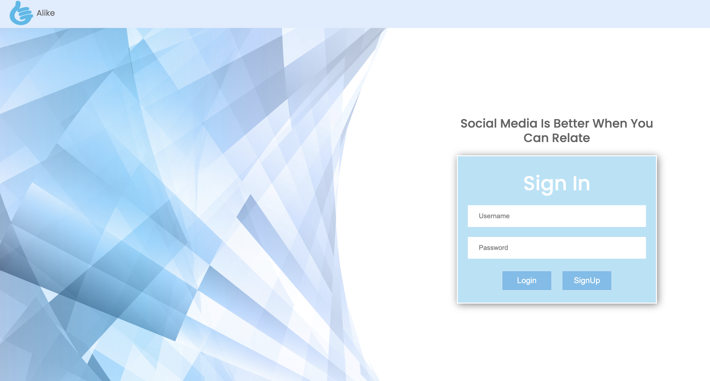
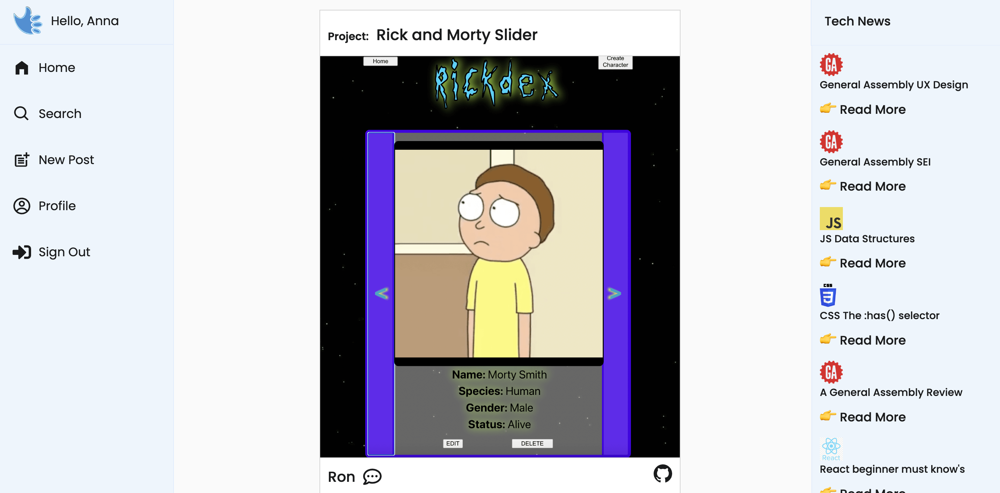
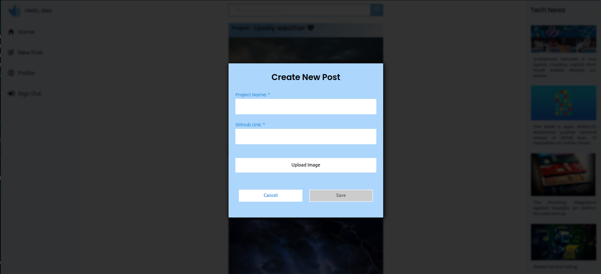
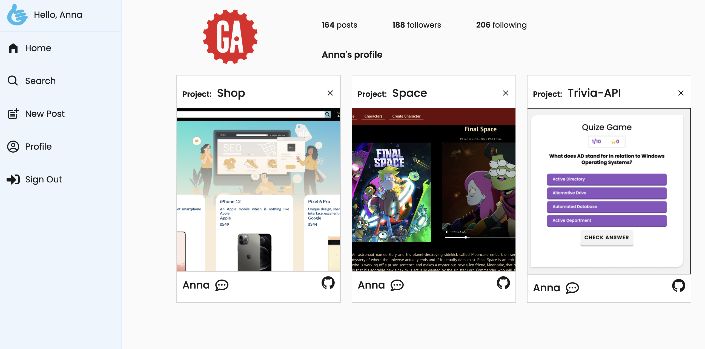
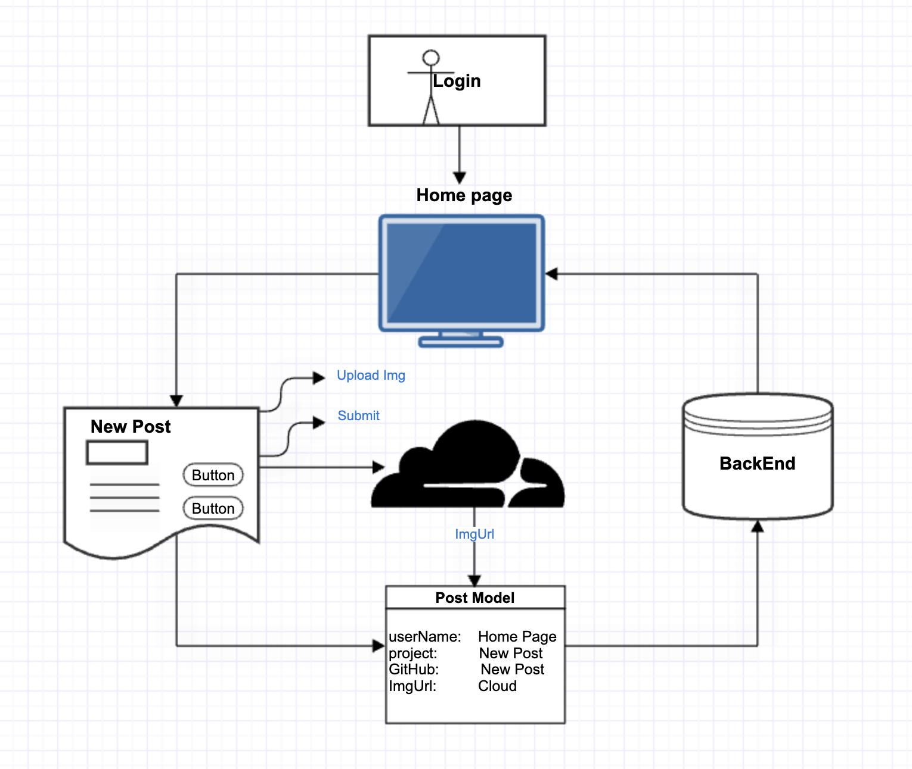
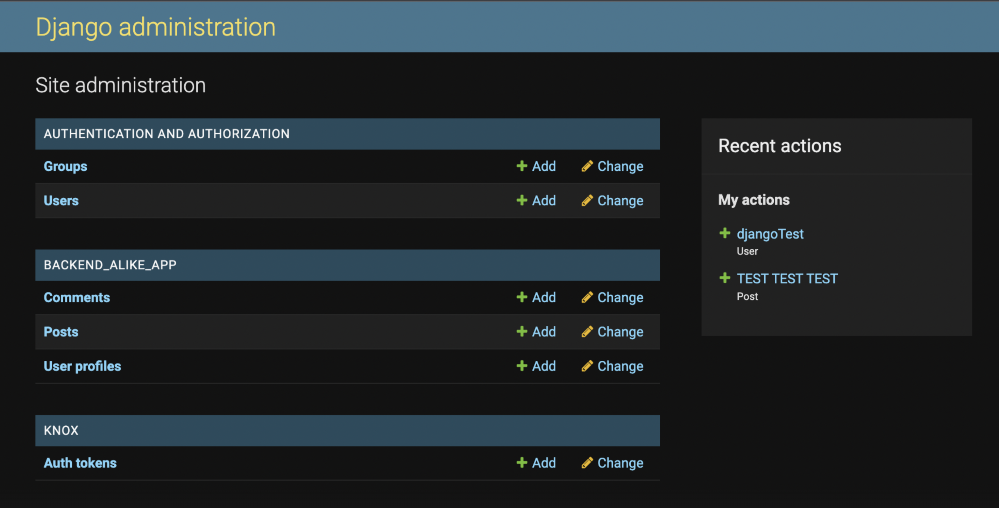

# FrontEnd-Alike

Alike is a social media platform where innovative minds collaborate and share ideas to create the projects of tomorrow. The platform is deisgned so developers can showcase their projects, share their feedback, and keep up on all the latest technology.

Built by developers - for developers!

## Screen Shots

### Landing Page

### Home

### Add Post

### Edit Post

### Profile

## Pages

To navigate to an individual page via the URL, use the following:

Landing Page: https://alike-ga.netlify.app/

## Technical Notes

### Data

The API provided several fields of data used for this project:

- All Users: https://backend-alike.herokuapp.com/user/
- All Posts: https://backend-alike.herokuapp.com/posts/,
- Single Post: https://backend-alike.herokuapp.com/post/:id

### Dependencies

- axios
- node-fetch
- react
- react-dom
- react-icons
- react-router-dom
- react-scripts
- cloudinary-react
- sweetalert
- cypress
- @mui/material
- @emotion/styled
- @emotion/react

### Data Flow

## Overview of Process

### Stage 0 - Planning (All)

Established the goal of creating an app to showcase technical projects in a social media environment. We developed a wireframe, outlined component swap on the front-end, agreed on the overall data flow of the project, set data structure with clear models, determined what we needed at a minimum to be released from the back-end to begin testing, set timelines for when we hoped to achieve each state, and reviewed general Git workflow.

### Stage 1 - Initial Set-Up

Back End (Ron, Nick, Ryan, Vasilis)

- Initialized backend repo
- Project scaffolding and file structure

Front End (Anna, Jose, Ari)

- Initialized frontend repo
- Project scaffolding and file structure
- Created dummy data to run tests
- Develop UI concept

Goal: Working on these items allowed us to get to a point where we could divide work and pair program

### Stage 2 - Get Back End Running, Front End Development

Back End (Ron, Nick, Ryan, Vasilis)

- Review and build models
- Register models, set up serializers, build views
- Set up back end routes with rest_framework and paths
- Added some dummy data to back end
- Research Cloudinary media hosting
- Lots of Heroku deployment debugging

Front End (Anna, Ari, Jose)

- Built Components and rendered outlines to page
- Built Screens and set up front end routes
- Refined home page design
- Built likes component

Goal: Get some basic functionality on the page, identify unforseen problems and adjust timeline.

### Stage 3 - Connect Front and Back Ends, Front End Logic

Back End (Ron, Nick, Ryan, Vasilis)

- Researched and worked on JWT User Auth (can return tokens)
- Deployed site and tested creation of posts from front end create panel
- Refactored User models
- Set up Cloudinary API and presets

Front End (Anna, Jose, Ari, Ron)

- Unified the CSS practices throughout
- Started build out of profile page
- Create post, delete button logic built
- Added responsive mobile design
- Route testing

Goal: We worked to ensure the site was in working order with the basic features we wanted to achieve.

### Stage 4 - Enhance Backend Data and Finalize Front End

Back End (Ron, Ryan, Nick, Vasilis)

- Resolved deployment issues after front end was deployed
- Prioritized key features and refined backend data
- Replaced all dummy data (cat photos) with real project posts
- Created users for all team members
- Added comments throughout code, de-briefed front end team on back end code, added README

Front-End (All)

- Finalized logo
- Reviewed and finalized CSS design across pages for consistency
- Finished profile page, filtered delete buttons based on users
- Added cropping to Cloudinary upload widget
- Deployed on Netlify

Goal: Finalized project and prepared for presenting

### Stage 5 - Enhanced Site Features

Back End (Ron, Ryan, Nick, Vasilis, Alex)

- "Like" Feature into Models and Views
- User Authentication (Knox)
- "Single Post" view set
- Sign-up and Sign-in view set 

Front-End (All)

- User Authentication (Knox)
- Included "Like" button
- Refactored Edit and Create Modal
- Refined layout and CSS
- Implemented Search Bar
- Tech News API 

Goal: Create a more robust User Experience when using the Alike site.  Additionally, refine and implement features that were discussed in the initial planning stages.

## API Endpoints

Home: https://backend-alike.herokuapp.com/
User: https://backend-alike.herokuapp.com/user
Post: https://backend-alike.herokuapp.com/post/:id
Posts: https://backend-alike.herokuapp.com/posts
Admin: https://backend-alike.herokuapp.com/admin

Snippet of object output:

## Future Features

### **Front End**

Within Reach...

- Comment section with "likes"
- Like button that stores which user has clicked
- Admin with superuser powers to create advertised posts and oversee the site
- Pagination for API calls (display ~50 results instead of calling the entire API)

A bit tricky...

- Follow friends' profiles
- Archiving your favorite projects
- Direct messaging between users
- Targeted advertising in the form of posts

### **Back End**

Within Reach...

- Pagination
- Adding the relationship for users to follow / friend one another

A bit tricky...

- Make a new table for 'Forums'
- Tracking which user liked which post
- Direct messaging between users

## Team

Anna Druzhinina

[LinkedIn](https://www.linkedin.com/in/anna-druzhinina/) |
[GitHub](https://github.com/annadruzhinina)

Argurjana Olloni

[LinkedIn](https://www.linkedin.com/in/aolloni/) |
[GitHub](https://github.com/argurjanaolloni)

Jose Calderon

[LinkedIn](https://www.linkedin.com/in/jose-a-calderon-software-engineer/) |
[GitHub](https://github.com/HowzayCalderon)

Ryan Ehrlich (Project Manager)

[LinkedIn](https://www.linkedin.com/in/ryanehrlich/) |
[GitHub](https://github.com/Jagerziel)

Vasilis Myrianthopoulos

[LinkedIn](https://www.linkedin.com/in/vasilis-myrianthopoulos/) |
[GitHub](https://github.com/Vasilis89)

Ron Lanzilotta

[LinkedIn](https://www.linkedin.com/in/ronlanzilotta/) |
[GitHub](https://github.com/RonLanzilotta)

Nick Fasulo

[LinkedIn](https://www.linkedin.com/in/nicholas-fasulo/) |
[GitHub](https://github.com/NickFasulo)

Alex Chang

[LinkedIn](https://www.linkedin.com/in/alexlchang/) |
[GitHub](https://github.com/individual-ism)
